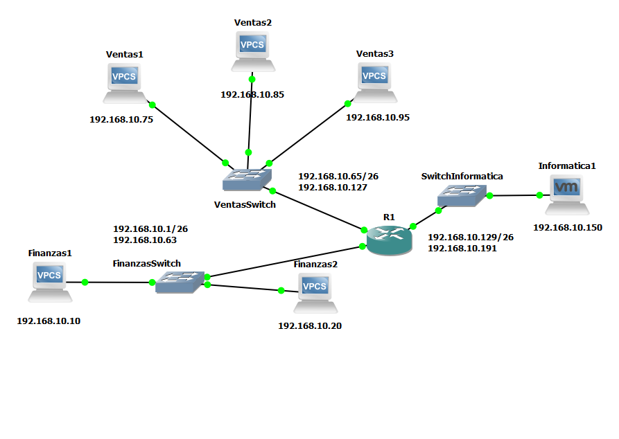
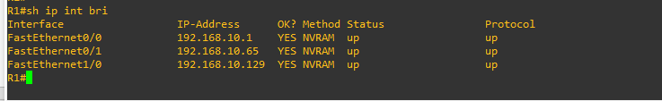
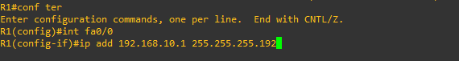
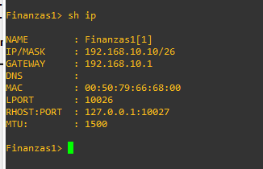
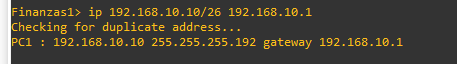
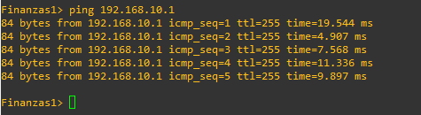
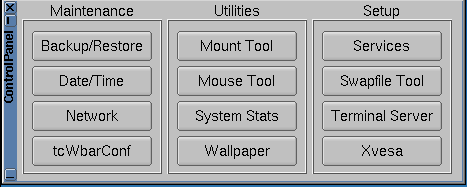
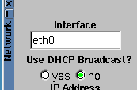
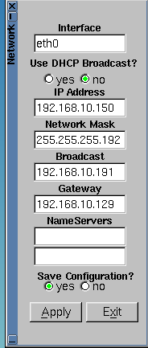
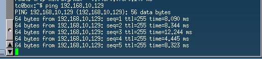

# Redes1-Práctica2_201700886
La practicá una consiste en realizar una red de computadoras pequeña usando diversas interfaces, la 
manera en la que se comprueba que la conexión sea correcta entre los equipos es con el comando **ping** hacia una ip de algú equipo de la 
red, fue implementado en **GNS3** se utilizó la imagen **C3725** como router ademas la computadora virtualizada corre en **vmware** usando **tiny core**, al router se 
le agrego un nuevo elemento en su apartado de "slot" para poder tener otra interfaz. 
### Componentes Utilizados
Se realizó una pequeña red con:
- 1 routers(C3725)
- 3 switch
- 5 vpc
- 1 computadora virtualizada ejecutando tiny core.
### Comandos Utilizados Y Su Funcionalidad.
- ping 
>sirve para comprobar la conexión entre 2 interfaces.
- ena
>utilizado para habilitar la cofiguración del router.
- sh int bri
>utilizado para verificar las interfaces del router.
- int fa **x/n**
>sirve para configurar la interfaz, los valores posibles se encuentran con **sh int bri**.
- full-duplex
>indica que la conexión que se manejará es de tipo full-duplex.
- speed **x**
>para indicar el valor de transferencia de la información.
- ip add **CIDR** **GATEWAY**
>sirve para configurar la dirección ip de la interfaz e indicar el valor de **GATEWAY***.
- no sthudown
>para mantener la interfaz activa
- exit
>para salir del actual menú de configuración.
- write
> para escribir los cambios de configuración en el rputer.
- save
>para guardar la configuración en un **VPC**.
### Topología Utilizada En La Red
Se conectaron 3 Switch a un router principal, se dividio en 3 subrredes.
> Red de informatica, tenia una pc virtualizada
> Red de ventas tenia 3 computadoras
> Red de Finanzas tenia 2 computadoras

### Configuración Individual De Cada Componente

- **Configuración De La Interfaz Del Router**
  Para configurar el router en GNS3 necesitamos activarlo y darle doble click y se abrira una consola, en la consola nceesitamos usar los siguientes comandosÑ
  - **ena**
  - **sh ip int bri** se nos mostrara la informacion de las interfaces del router
  
 
  
  - **configure terminal**
  - **int fa 0/0** para entrar a la interfaz 0/0
  - **ip add 192.168.10.1 255.255.255.192**  se coloca ip y la mascara de red para la interfaz
  - **no shutdow**
  - **exit**
  - **write** para guardar la configuracion
  
  
  
  Esa manera de configurar corresponde a los 2 switch que se conectan al router, los switch se concetan desded su puerto ethernet 0 al puerto fast ehternet del router     correspondiente,   se eligio diferente GATEWAY en cada interfaz del router para no incurrir en problemas de una dirección ip repetida

- **Configuración De Las VPC**

  configurar las VPC en GNS3 es bastante sencillo y rapido solo se necesitan 2 comandos, abrimos la VPC con doble click y escribimos:
  - **ip 192.168.10.10/26 192.168.10.1** con eso indicamos que la VPC tendrá la dirección ip 192.168.10.10 con mascara de subred 255.255.255.192 y que su gateway es de 192.168.10.1
  - **save** para guardar la condiguración
  - **ping 192.168.10.1** para comprobar la conección correcta al Gateway.
 
- **Configuración De La PC Virtualizada**

  iniciamos la pc virtualizada, le damos doble click y empezará a cargar VMWARE workstation, cuando termine de cargar se debe hacer lo siguiente.
  - Click Derecho y abrimos Control Panel que está adentro de System Tools
  
  - Se abrira una ventana y se le da click en Network para abrir una nueva ventana
  
  - En esta nueva ventana se escribe la dirección ip que la maquina tendrá aplicamos los cambios y abrimos un terminal, en aplications y luego terminal.
  
  - En el terminal escribimos **ping 192.168.10.129** para comprobar que la conexión con el gateway está correcta.
  
